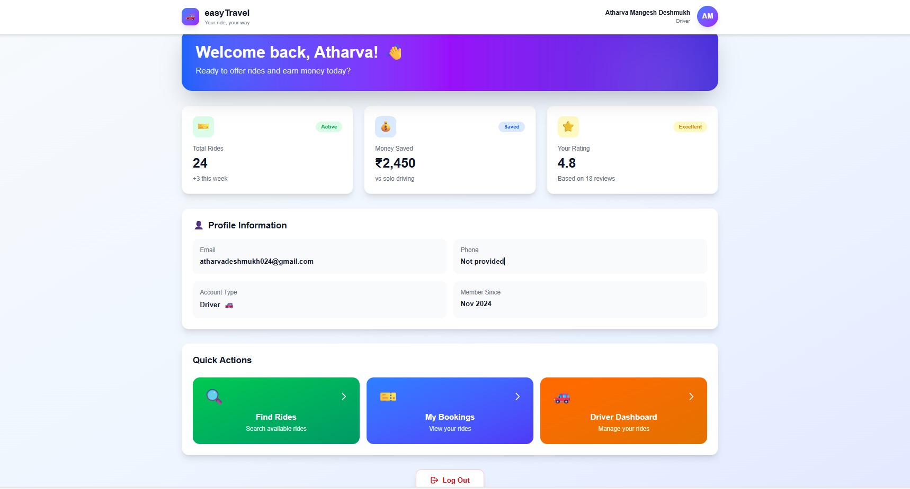
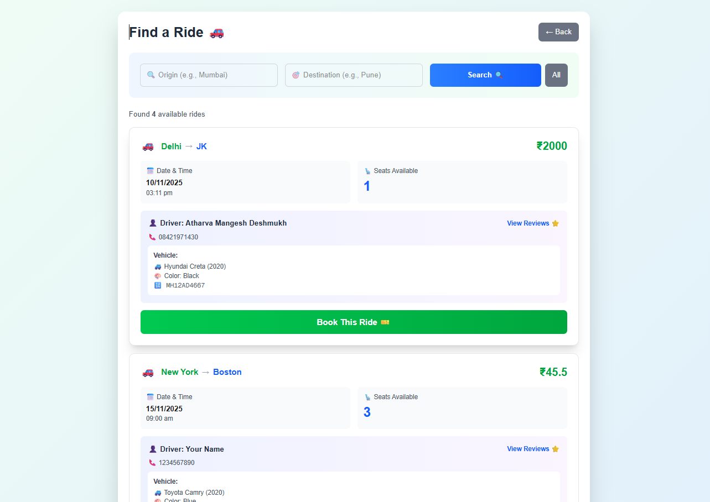
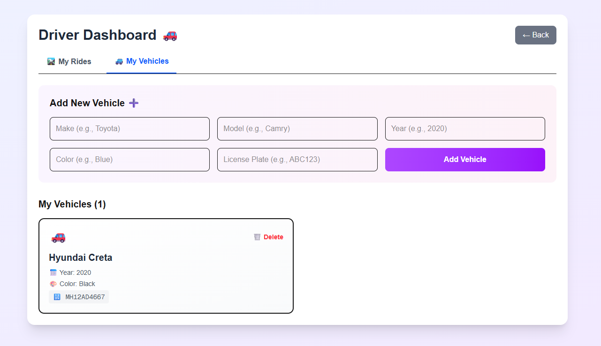

# 🚗 easyTravel — Smart Carpooling Platform

easyTravel is a full-stack carpooling platform designed to connect **drivers** and **passengers** and enable seamless, secure, and cost-effective shared travel. With a modern UI, scalable backend, and a structured database architecture, easyTravel delivers an experience similar to professional ride-sharing services.

---

## 🌟 Overview

easyTravel solves three major real-world problems:

- High cost of everyday travel  
- Underutilized vehicle capacity  
- Lack of reliable carpooling options  

It offers a secure and intuitive system where:

- **Drivers** can publish ride offers, manage bookings, and collect passenger reviews  
- **Passengers** can search and book rides, track status, and rate their travel experience  

This dual module design ensures clarity, safety, and operational efficiency.

---

## 🛠️ Technology Stack

### **Frontend**
- Next.js 14  
- React 18  
- TypeScript  
- Tailwind CSS  

### **Backend**
- Node.js + Express.js  
- TypeScript  
- JWT Authentication  
- Prisma ORM  

### **Database**
- PostgreSQL (Supabase)  

This stack ensures strong type safety (end-to-end TypeScript), consistent data integrity, and smooth development workflow.

---

## 🔥 Core Features

### ✅ Passenger Features
- Search rides by origin, destination, and date  
- View driver profile along with vehicle details  
- Real-time seat availability  
- Book rides instantly  
- View booking history and track status  
- Submit reviews after completed rides  

---

### ✅ Driver Features
- Register and manage vehicle(s)  
- Publish rides with detailed parameters  
- Accept or reject passenger bookings  
- Update ride status (Scheduled → Active → Completed)  
- Access rating and feedback from passengers  

---

### ✅ Platform Features
- Fully responsive UI (desktop + mobile)  
- JWT-based secured authentication  
- Password hashing with bcrypt  
- Role-based dashboard  
- Prisma-powered data relationships  
- Data validation & clean error handling  

---

## 📸 Project Screenshots

### 🔐 Authentication Pages


### 🏠 Dashboard


### 🧑‍✈️ Driver Panel


### 🚘 Find Rides


### 🚗 Vehicle Info


---

## 🏗️ System Architecture
```
User (Driver/Passenger)
│
▼
Authentication (JWT)
│
▼
Backend API (Node/Express)
│
▼
Database (PostgreSQL + Prisma)
│
▼
Frontend (Next.js/React)
```
## 📄 Database Schema (Prisma)

- **User**
- **Vehicle**
- **Ride**
- **Booking**
- **Review**

Each model is relationally linked ensuring stable data flow, eliminating duplication, and supporting scalable growth.

## 🔌 API Structure

### 🔐 Auth
- POST `/auth/register`
- POST `/auth/login`

### 🚘 Rides
- POST `/ride/create`
- GET `/ride/search`
- GET `/ride/myrides`
- PATCH `/ride/status/:rideId`

### 📖 Bookings
- POST `/booking/book`
- GET `/booking/my-bookings`
- PATCH `/booking/status/:bookingId`
- DELETE `/booking/cancel/:bookingId`

### ⭐ Reviews
- POST `/booking/review/:bookingId`
- GET `/booking/driver-reviews/:driverId`

### 🚗 Vehicles
- POST `/vehicle/add`
- GET `/vehicle/my-vehicles`
- DELETE `/vehicle/delete/:vehicleId`

## 📈 Future Enhancements

- Google Maps integration  
- Online payments (Razorpay / Stripe)  
- Live chat (real-time)  
- Push notifications  
- Admin dashboard  
- WebSocket-based updates  

## 👨‍💻 About the Author

**Atharva Deshmukh** is a full-stack and cloud developer specializing in Next.js, Node.js, TypeScript, and PostgreSQL. He has hands-on experience building scalable systems, secure REST APIs, and cloud-native applications using AWS services. Atharva has worked on impactful projects like easyTravel, MediVault, and a Twitter ETL analytics pipeline. He is an AWS Certified Cloud Practitioner, SIH 2024 finalist, and passionate about building clean, performant, and real-world solutions.

**LinkedIn:** [linkedin.com/in/atharvadeshmukh024](https://www.linkedin.com/in/atharvadeshmukh024)  
**GitHub:** [github.com/atharvadeshmukh0024](https://github.com/atharvadeshmukh0024)


